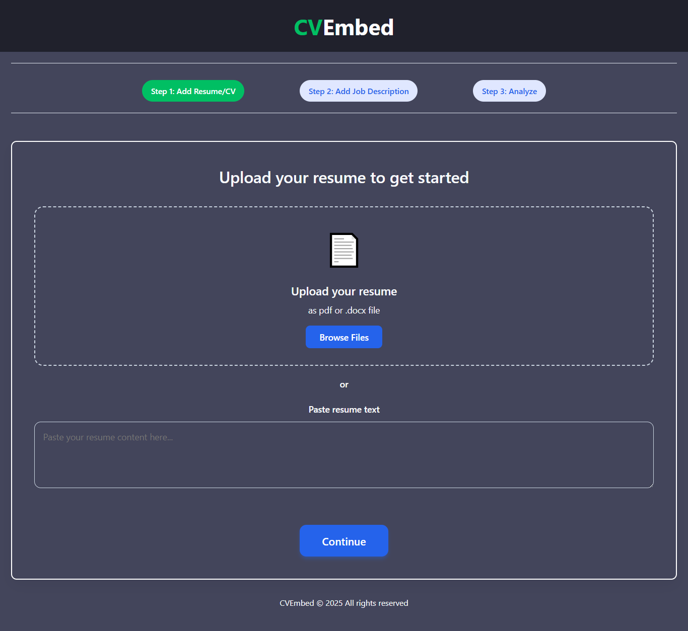
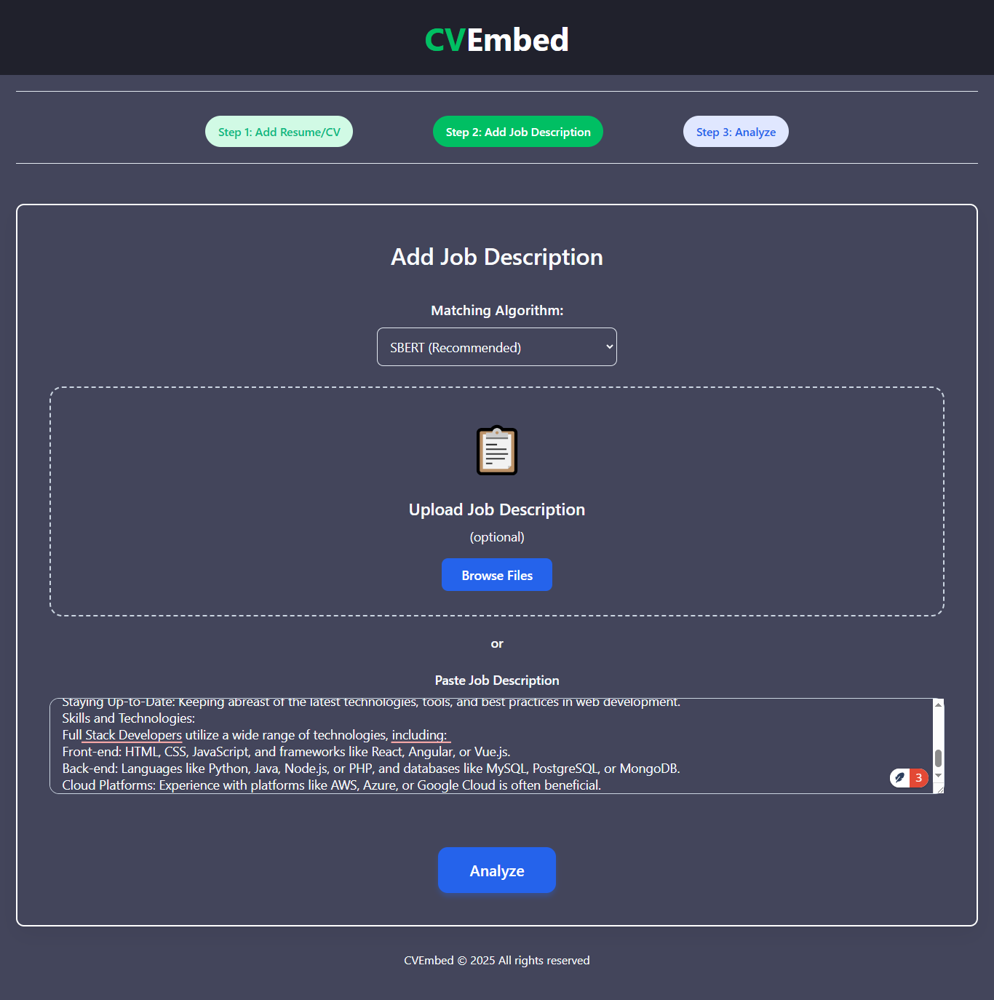
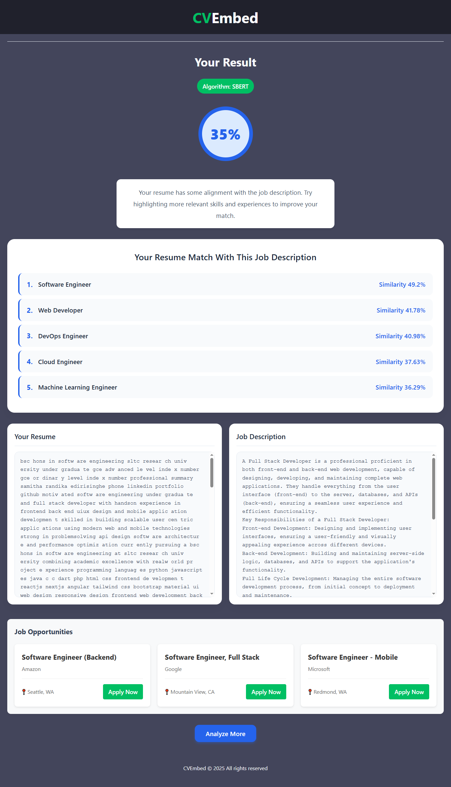

# CV Embed: AI-Powered Resume Matching System

CV Embed is an AI resume analyzer that matches candidates with job descriptions using SBERT/GloVe/Doc2Vec models. Calculates compatibility scores, suggests top job matches, and generates real opportunities. Supports PDF/DOCX uploads with Flask backend and Gemini AI integration.
---

## Key Features

- **AI-Powered Matching**: Semantic analysis using multiple NLP models  
- **Multi-Step Workflow**: Intuitive 3-step process for resume and job analysis  
- **File & Text Support**: Upload PDF/DOCX files or paste text directly  
- **Visual Results**: Clear similarity score visualization with color coding  
- **Top Job Suggestions**: Identifies best-fitting roles with similarity percentages  
- **Job Recommendations**: Real job opportunities based on profile  
- **Privacy Focused**: Automatic file cleanup after processing  

---

## Technology Stack

| Component           | Technology                          |
|---------------------|-------------------------------------|
| **Frontend**        | HTML5, CSS3, JavaScript             |
| **Backend**         | Python, Flask                       |
| **AI Engine**       | Sentence Transformers, Gensim       |
| **Text Processing** | NLTK, PyPDF2, python-docx           |
| **API Integration** | Google Gemini API                   |
| **Deployment**      | Docker (optional)                   |

---

## Project Structure

```
project_root/
├── model/
│   ├── inference/
│   ├── preprocess/
│   └── training/
├── trained_models/
├── templates/
│   ├── index.html
│   ├── result.html
│   └── upload.html
├── static/
├── data/
├── utils/
├── requirements.txt
├── config.py
├── data_loader.py
├── matching_engine.py
├── resume_processor.py
└── app.py
```

## Website Interface

### 1. Resume Upload Page

- Users can upload or paste their resumes on this page.  
  

### 2. job description Upload Page

- Users can upload or paste their **resumes** on this page.  
  

### 3. Results Page

- This page displays the top 5 job descriptions that match the uploaded resume.  
  


---

## Installation & Setup

### Prerequisites

- Python 3.8+  
- pip package manager  
- Google Gemini API key  

### Steps

1. **Clone the repository**  
   ```bash
   git clone https://github.com/Samitha-Edirisinghe/AI-Powered-Resume-Matching-System-CVEmbed-.git
   cd cv-embed
   ```

2. **Create a virtual environment**  
   ```bash
   # Windows
   python -m venv venv
   venv\Scripts\activate

   # macOS/Linux
   python3 -m venv venv
   source venv/bin/activate
   ```

3. **Install dependencies**  
   ```bash
   pip install -r requirements.txt
   ```

4. **Download NLTK data**  
   ```bash
   python -c "import nltk; nltk.download('stopwords'); nltk.download('punkt')"
   ```

5. **Set environment variables**  
   Create a `.env` file in project root:
   ```env
   GEMINI_API_KEY=your_api_key_here
   ```

6. **Run the application**  
   ```bash
   python app.py
   ```
   Then open `http://localhost:5000` in your browser.

---

## Usage Workflow

1. **Upload Resume**  
   - Select a PDF/DOCX file or paste resume text  
   - Click **Continue**

2. **Upload Job Description**  
   - Select a job description file or paste text  
   - Choose matching algorithm (SBERT recommended)  
   - Click **Analyze**

3. **View Results**  
   - See your match percentage  
   - Explore top job suggestions  
   - Compare resume and job description  
   - Browse real job opportunities  
   - Click **Analyze More** to start over

---

## AI Models

The system supports three matching algorithms:

1. **SBERT (Recommended)**  
   - Uses Sentence Transformers for semantic similarity  
   - Trained on job description–resume pairs  

2. **GloVe**  
   - Word embedding–based matching  
   - Uses average word vectors  

3. **Doc2Vec**  
   - Document embedding approach  
   - Trained on a resume corpus  

---

## Data Sources

| Dataset                        | Source                                                        |
|--------------------------------|---------------------------------------------------------------|
| job_cv_supervised              | [Hugging Face](https://huggingface.co/datasets/bwbayu/job_cv_supervised)       |
| resume-job-description-fit     | [Hugging Face](https://huggingface.co/datasets/cnamuangtoun/resume-job-description-fit) |
| Resume-Dataset                 | [Hugging Face](https://huggingface.co/datasets/InferencePrince555/Resume-Dataset)       |
| IT Job Post Descriptions       | [Kaggle](https://www.kaggle.com/datasets/mscgeorges/itjobpostdescriptions)         |

---

## Job Taxonomy

The system matches resumes to these roles:

- System Administrator  
- Database Administrator  
- Web Developer  
- Security Analyst  
- Network Administrator  
- Data Scientist  
- DevOps Engineer  
- Cloud Engineer  
- Machine Learning Engineer  
- Software Engineer  

---

## Configuration

Edit **`config.py`** to:

- Change active model  
- Modify job taxonomy  
- Add/remove datasets  
- Adjust model parameters  

---

## Contributing

1. Fork the repository  
2. Create your feature branch (`git checkout -b feature/your-feature`)  
3. Commit your changes (`git commit -m 'Add some feature'`)  
4. Push to the branch (`git push origin feature/your-feature`)  
5. Open a pull request  

---

## License

This project is licensed under the MIT License. See the LICENSE file for details.

---

## Contact

For questions or feedback, reach out at:  
[randikanilupul123@gmail.com](mailto:randikanilupul123@gmail.com)
